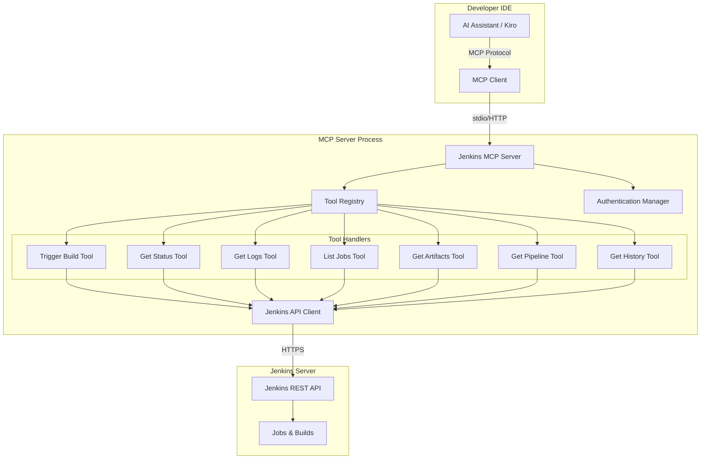

# Design Document

## Overview

This design document outlines the implementation of a Jenkins MCP (Model Context Protocol) server integration that enables developers to interact with Jenkins CI/CD pipelines through their AI assistant in the IDE. The solution consists of three main components:

1. **MCP Server Configuration** - Setup and connection management for the Jenkins MCP server
2. **Jenkins API Client** - A wrapper around Jenkins REST API for executing operations
3. **MCP Tool Handlers** - Individual tool implementations that expose Jenkins functionality through MCP

The design follows the MCP specification, which defines how AI assistants communicate with external tools through a standardized protocol. The Jenkins MCP server acts as a bridge, translating MCP tool calls into Jenkins API requests and returning formatted responses.

## Architecture

### High-Level Architecture



### Component Interaction Flow

1. **Configuration Phase**: Developer configures Jenkins MCP server in `.kiro/settings/mcp.json` with Jenkins URL and credentials
2. **Connection Phase**: MCP server starts and establishes connection to Jenkins, validating credentials
3. **Tool Discovery**: AI assistant queries available tools from the MCP server
4. **Tool Execution**: Developer asks AI assistant to perform Jenkins operation (e.g., "trigger a build")
5. **MCP Translation**: AI assistant translates request into MCP tool call with parameters
6. **API Execution**: MCP server receives tool call, validates parameters, and executes Jenkins API request
7. **Response Formatting**: MCP server formats Jenkins API response into structured data
8. **Result Display**: AI assistant presents results to developer in natural language

## Components and Interfaces

### 1. MCP Server Configuration

**Purpose**: Manage Jenkins connection settings and MCP server lifecycle

**Configuration Schema** (`.kiro/settings/mcp.json`):
```json
{
  "mcpServers": {
    "jenkins": {
      "command": "npx",
      "args": ["-y", "@modelcontextprotocol/server-jenkins"],
      "env": {
        "JENKINS_URL": "https://jenkins.example.com",
        "JENKINS_USER": "username",
        "JENKINS_TOKEN": "api-token-here",
        "JENKINS_TIMEOUT": "30000"
      },
      "disabled": false,
      "autoApprove": [
        "jenkins_get_job_status",
        "jenkins_list_jobs",
        "jenkins_get_build_log"
      ]
    }
  }
}
```

**Configuration Parameters**:
- `JENKINS_URL`: Base URL of Jenkins server (required)
- `JENKINS_USER`: Jenkins username for authentication (required)
- `JENKINS_TOKEN`: Jenkins API token (required, more secure than password)
- `JENKINS_TIMEOUT`: Request timeout in milliseconds (optional, default: 30000)

**Auto-Approve List**: Tools that don't require user confirmation before execution (read-only operations)

### 2. Jenkins API Client

**Purpose**: Provide a clean interface to Jenkins REST API with error handling and retry logic

**Interface**:
```typescript
interface JenkinsClient {
  // Connection management
  connect(): Promise<void>;
  disconnect(): Promise<void>;
  isConnected(): boolean;
  
  // Job operations
  listJobs(folder?: string): Promise<Job[]>;
  getJob(jobName: string): Promise<JobDetails>;
  triggerBuild(jobName: string, parameters?: Record<string, string>): Promise<BuildInfo>;
  
  // Build operations
  getBuildStatus(jobName: string, buildNumber?: number): Promise<BuildStatus>;
  getBuildLog(jobName: string, buildNumber: number, options?: LogOptions): Promise<string>;
  getBuildArtifacts(jobName: string, buildNumber: number): Promise<Artifact[]>;
  downloadArtifact(jobName: string, buildNumber: number, artifactPath: string, localPath: string): Promise<void>;
  
  // Pipeline operations
  getPipelineStages(jobName: string, buildNumber: number): Promise<PipelineStage[]>;
  getStageLog(jobName: string, buildNumber: number, stageId: string): Promise<string>;
  
  // History operations
  getBuildHistory(jobName: string, count: number): Promise<Build[]>;
  getTestResults(jobName: string, buildNumber: number): Promise<TestResults>;
}
```

**Error Handling Strategy**:
- Network errors: Retry up to 3 times with exponential backoff
- Authentication errors: Return clear error message, don't retry
- 404 errors: Return "not found" message with suggestions
- 500 errors: Return server error message, retry once after 5 seconds

### 3. MCP Tool Handlers

Each tool handler implements the MCP tool interface and delegates to the Jenkins API client.

#### Tool: `jenkins_trigger_build`

**Description**: Triggers a Jenkins job build with optional parameters

**Input Schema**:
```json
{
  "type": "object",
  "properties": {
    "jobName": {
      "type": "string",
      "description": "Name of the Jenkins job to trigger"
    },
    "parameters": {
      "type": "object",
      "description": "Build parameters as key-value pairs",
      "additionalProperties": { "type": "string" }
    },
    "branch": {
      "type": "string",
      "description": "Git branch to build (optional, auto-detected if not provided)"
    }
  },
  "required": ["jobName"]
}
```

**Output Schema**:
```json
{
  "type": "object",
  "properties": {
    "buildNumber": { "type": "number" },
    "queueId": { "type": "number" },
    "jobUrl": { "type": "string" },
    "estimatedDuration": { "type": "number" }
  }
}
```

**Implementation Logic**:
1. Validate job name exists
2. If branch not provided, detect current Git branch from workspace
3. Merge branch into parameters if job supports it
4. Call Jenkins API to queue build
5. Poll queue until build number is assigned
6. Return build information

#### Tool: `jenkins_get_build_status`

**Description**: Retrieves the status of a Jenkins build

**Input Schema**:
```json
{
  "type": "object",
  "properties": {
    "jobName": {
      "type": "string",
      "description": "Name of the Jenkins job"
    },
    "buildNumber": {
      "type": "number",
      "description": "Build number (optional, defaults to latest)"
    }
  },
  "required": ["jobName"]
}
```

**Output Schema**:
```json
{
  "type": "object",
  "properties": {
    "buildNumber": { "type": "number" },
    "status": { 
      "type": "string",
      "enum": ["SUCCESS", "FAILURE", "UNSTABLE", "ABORTED", "IN_PROGRESS", "NOT_BUILT"]
    },
    "duration": { "type": "number" },
    "timestamp": { "type": "string" },
    "currentStage": { "type": "string" },
    "estimatedRemaining": { "type": "number" },
    "url": { "type": "string" }
  }
}
```

#### Tool: `jenkins_get_build_log`

**Description**: Retrieves console output from a Jenkins build

**Input Schema**:
```json
{
  "type": "object",
  "properties": {
    "jobName": { "type": "string" },
    "buildNumber": { "type": "number" },
    "tailLines": {
      "type": "number",
      "description": "Return only last N lines (optional)"
    },
    "errorOnly": {
      "type": "boolean",
      "description": "Return only error-related sections (optional)"
    }
  },
  "required": ["jobName", "buildNumber"]
}
```

**Output Schema**:
```json
{
  "type": "object",
  "properties": {
    "log": { "type": "string" },
    "hasMore": { "type": "boolean" },
    "totalLines": { "type": "number" }
  }
}
```

**Implementation Logic**:
1. Fetch console output from Jenkins API
2. Strip ANSI color codes for readability
3. If `errorOnly` is true, filter for lines containing error keywords
4. If `tailLines` specified, return only last N lines
5. Indicate if log was truncated

#### Tool: `jenkins_list_jobs`

**Description**: Lists all accessible Jenkins jobs

**Input Schema**:
```json
{
  "type": "object",
  "properties": {
    "folder": {
      "type": "string",
      "description": "Folder path to list jobs from (optional)"
    },
    "filter": {
      "type": "string",
      "description": "Filter jobs by name pattern (optional)"
    }
  }
}
```

**Output Schema**:
```json
{
  "type": "object",
  "properties": {
    "jobs": {
      "type": "array",
      "items": {
        "type": "object",
        "properties": {
          "name": { "type": "string" },
          "fullName": { "type": "string" },
          "description": { "type": "string" },
          "lastBuildStatus": { "type": "string" },
          "lastBuildTime": { "type": "string" },
          "isBuilding": { "type": "boolean" },
          "url": { "type": "string" }
        }
      }
    }
  }
}
```

#### Tool: `jenkins_get_pipeline_stages`

**Description**: Retrieves detailed pipeline stage information

**Input Schema**:
```json
{
  "type": "object",
  "properties": {
    "jobName": { "type": "string" },
    "buildNumber": { "type": "number" }
  },
  "required": ["jobName", "buildNumber"]
}
```

**Output Schema**:
```json
{
  "type": "object",
  "properties": {
    "stages": {
      "type": "array",
      "items": {
        "type": "object",
        "properties": {
          "id": { "type": "string" },
          "name": { "type": "string" },
          "status": { "type": "string" },
          "startTime": { "type": "string" },
          "duration": { "type": "number" },
          "error": { "type": "string" },
          "isParallel": { "type": "boolean" }
        }
      }
    }
  }
}
```

#### Tool: `jenkins_get_artifacts`

**Description**: Lists and downloads build artifacts

**Input Schema**:
```json
{
  "type": "object",
  "properties": {
    "jobName": { "type": "string" },
    "buildNumber": { "type": "number" },
    "download": {
      "type": "boolean",
      "description": "Whether to download artifacts (optional)"
    },
    "artifactPath": {
      "type": "string",
      "description": "Specific artifact to download (optional)"
    },
    "localPath": {
      "type": "string",
      "description": "Local path to save artifact (required if download=true)"
    }
  },
  "required": ["jobName", "buildNumber"]
}
```

**Output Schema**:
```json
{
  "type": "object",
  "properties": {
    "artifacts": {
      "type": "array",
      "items": {
        "type": "object",
        "properties": {
          "fileName": { "type": "string" },
          "relativePath": { "type": "string" },
          "size": { "type": "number" },
          "downloadUrl": { "type": "string" }
        }
      }
    },
    "downloaded": {
      "type": "string",
      "description": "Path where artifact was saved (if download=true)"
    }
  }
}
```

#### Tool: `jenkins_get_build_history`

**Description**: Retrieves build history and trends for a job

**Input Schema**:
```json
{
  "type": "object",
  "properties": {
    "jobName": { "type": "string" },
    "count": {
      "type": "number",
      "description": "Number of builds to retrieve (default: 10)"
    },
    "includeTrends": {
      "type": "boolean",
      "description": "Include trend analysis (default: true)"
    }
  },
  "required": ["jobName"]
}
```

**Output Schema**:
```json
{
  "type": "object",
  "properties": {
    "builds": {
      "type": "array",
      "items": {
        "type": "object",
        "properties": {
          "buildNumber": { "type": "number" },
          "status": { "type": "string" },
          "timestamp": { "type": "string" },
          "duration": { "type": "number" },
          "testsPassed": { "type": "number" },
          "testsFailed": { "type": "number" }
        }
      }
    },
    "trends": {
      "type": "object",
      "properties": {
        "successRate": { "type": "number" },
        "averageDuration": { "type": "number" },
        "consecutiveFailures": { "type": "number" },
        "stability": { "type": "string" }
      }
    }
  }
}
```

## Data Models

### Job
```typescript
interface Job {
  name: string;
  fullName: string;
  description: string;
  url: string;
  buildable: boolean;
  lastBuild?: BuildReference;
  lastSuccessfulBuild?: BuildReference;
  lastFailedBuild?: BuildReference;
  isBuilding: boolean;
}
```

### BuildStatus
```typescript
enum BuildResult {
  SUCCESS = "SUCCESS",
  FAILURE = "FAILURE",
  UNSTABLE = "UNSTABLE",
  ABORTED = "ABORTED",
  IN_PROGRESS = "IN_PROGRESS",
  NOT_BUILT = "NOT_BUILT"
}

interface BuildStatus {
  buildNumber: number;
  status: BuildResult;
  duration: number;
  timestamp: Date;
  url: string;
  currentStage?: string;
  estimatedRemaining?: number;
}
```

### PipelineStage
```typescript
interface PipelineStage {
  id: string;
  name: string;
  status: BuildResult;
  startTime: Date;
  duration: number;
  error?: string;
  isParallel: boolean;
  parallelStages?: PipelineStage[];
}
```

### Artifact
```typescript
interface Artifact {
  fileName: string;
  relativePath: string;
  size: number;
  downloadUrl: string;
}
```

## Error Handling

### Error Categories and Responses

1. **Connection Errors**
   - Scenario: Jenkins server unreachable
   - Response: "Unable to connect to Jenkins at {url}. Please check your network connection and Jenkins URL configuration."
   - Action: Retry with exponential backoff (1s, 2s, 4s)

2. **Authentication Errors**
   - Scenario: Invalid credentials or expired token
   - Response: "Authentication failed. Please verify your Jenkins username and API token in the MCP configuration."
   - Action: No retry, prompt for credential update

3. **Job Not Found**
   - Scenario: Requested job doesn't exist
   - Response: "Job '{jobName}' not found. Available jobs: {list of similar job names}"
   - Action: Suggest similar job names using fuzzy matching

4. **Build Not Found**
   - Scenario: Requested build number doesn't exist
   - Response: "Build #{buildNumber} not found for job '{jobName}'. Latest build is #{latestBuildNumber}"
   - Action: Return latest build number

5. **Permission Denied**
   - Scenario: User lacks permissions for operation
   - Response: "Permission denied. You don't have access to {operation} for job '{jobName}'"
   - Action: No retry

6. **Timeout Errors**
   - Scenario: Request exceeds timeout
   - Response: "Request timed out after {timeout}ms. Jenkins may be experiencing high load."
   - Action: Retry once with increased timeout

### Error Response Format

All errors follow a consistent structure:
```json
{
  "error": {
    "code": "ERROR_CODE",
    "message": "Human-readable error message",
    "details": {
      "jobName": "example-job",
      "suggestions": ["similar-job-1", "similar-job-2"]
    }
  }
}
```

## Testing Strategy

### Unit Tests

**Jenkins API Client Tests**:
- Mock Jenkins REST API responses
- Test connection establishment and retry logic
- Test authentication with valid/invalid credentials
- Test each API method with success and error scenarios
- Test timeout handling
- Test response parsing and data transformation

**MCP Tool Handler Tests**:
- Mock Jenkins API client
- Test input validation for each tool
- Test output formatting for each tool
- Test error propagation from API client to MCP response
- Test parameter defaults and optional fields

### Integration Tests

**End-to-End MCP Flow**:
- Set up test Jenkins instance or use Jenkins test container
- Configure MCP server with test credentials
- Execute each tool through MCP protocol
- Verify correct Jenkins API calls are made
- Verify responses match expected schema

**Scenarios to Test**:
1. Trigger build → Monitor status → Retrieve logs (success case)
2. Trigger build → Monitor status → Retrieve logs (failure case)
3. List jobs → Get job details → Trigger build
4. Get pipeline stages for multi-stage pipeline
5. Download artifacts from successful build
6. Get build history and verify trend calculations

### Manual Testing Checklist

- [ ] Configure MCP server with real Jenkins instance
- [ ] Test connection with valid credentials
- [ ] Test connection with invalid credentials
- [ ] Trigger a parameterized build through AI assistant
- [ ] Monitor build progress in real-time
- [ ] Retrieve logs from failed build
- [ ] List jobs and verify filtering works
- [ ] Download artifact from build
- [ ] View pipeline stages for complex pipeline
- [ ] Check build history and trends
- [ ] Test with Jenkins behind VPN
- [ ] Test with Jenkins using self-signed certificate

## Security Considerations

1. **Credential Storage**:
   - Store Jenkins API token in MCP config (not password)
   - Config file should have restricted permissions (600)
   - Never log credentials in error messages or debug output

2. **API Token Generation**:
   - Guide users to generate API tokens from Jenkins user settings
   - Tokens should have minimal required permissions
   - Recommend separate tokens for different environments

3. **HTTPS Enforcement**:
   - Require HTTPS for Jenkins URL in production
   - Allow HTTP only for localhost/development
   - Validate SSL certificates by default

4. **Input Validation**:
   - Sanitize all user inputs before passing to Jenkins API
   - Prevent path traversal in artifact downloads
   - Validate job names against allowed characters

5. **Rate Limiting**:
   - Implement client-side rate limiting to avoid overwhelming Jenkins
   - Maximum 10 requests per second per user
   - Queue requests if limit exceeded

## Performance Optimization

1. **Caching Strategy**:
   - Cache job list for 30 seconds
   - Cache build status for 5 seconds (only for completed builds)
   - Invalidate cache on write operations (trigger build)

2. **Lazy Loading**:
   - Don't fetch full build logs unless explicitly requested
   - Fetch pipeline stages only when needed
   - Stream large artifacts instead of loading into memory

3. **Parallel Requests**:
   - When fetching multiple builds, make parallel API calls
   - Limit concurrent requests to 5 to avoid overwhelming Jenkins

4. **Response Compression**:
   - Request gzip compression from Jenkins API
   - Compress large log outputs before returning to MCP client

## Deployment and Configuration Guide

### Step 1: Install Prerequisites

Ensure Node.js and npm are installed (required for MCP server):
```bash
node --version  # Should be v18 or higher
npm --version
```

### Step 2: Generate Jenkins API Token

1. Log into Jenkins web interface
2. Click your username → Configure
3. Scroll to "API Token" section
4. Click "Add new Token"
5. Give it a name (e.g., "MCP Integration")
6. Click "Generate" and copy the token

### Step 3: Configure MCP Server

Create or update `.kiro/settings/mcp.json`:
```json
{
  "mcpServers": {
    "jenkins": {
      "command": "npx",
      "args": ["-y", "@modelcontextprotocol/server-jenkins"],
      "env": {
        "JENKINS_URL": "https://your-jenkins-server.com",
        "JENKINS_USER": "your-username",
        "JENKINS_TOKEN": "your-api-token-here"
      },
      "disabled": false,
      "autoApprove": [
        "jenkins_get_build_status",
        "jenkins_list_jobs",
        "jenkins_get_build_log",
        "jenkins_get_pipeline_stages",
        "jenkins_get_artifacts",
        "jenkins_get_build_history"
      ]
    }
  }
}
```

### Step 4: Restart Kiro or Reconnect MCP Server

The MCP server will automatically connect when Kiro starts, or you can reconnect from the MCP Server view.

### Step 5: Test the Connection

Ask your AI assistant:
- "List my Jenkins jobs"
- "What's the status of the latest build for [job-name]?"

If successful, you'll see job information. If not, check the error message for configuration issues.

## Future Enhancements

1. **Webhook Support**: Receive real-time notifications when builds complete
2. **Blue Ocean API**: Support for Blue Ocean pipeline visualization
3. **Multi-Server Support**: Connect to multiple Jenkins instances
4. **Build Comparison**: Compare two builds side-by-side
5. **Custom Dashboards**: Create personalized views of important jobs
6. **Build Scheduling**: Schedule builds for future execution
7. **Node Management**: View and manage Jenkins build agents
8. **Plugin Management**: List and update Jenkins plugins through MCP
